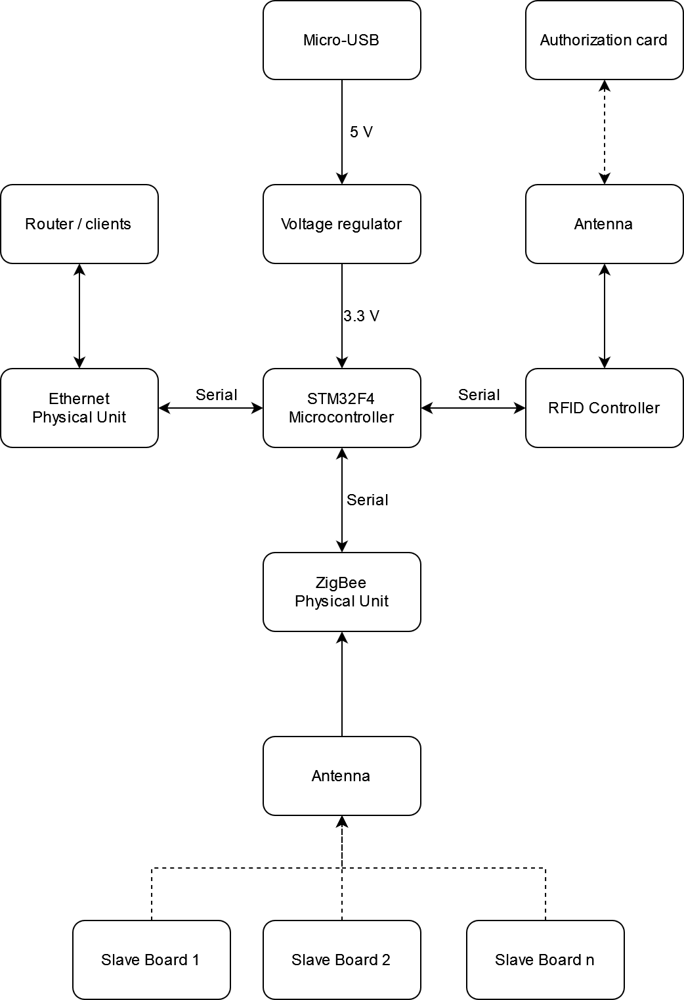
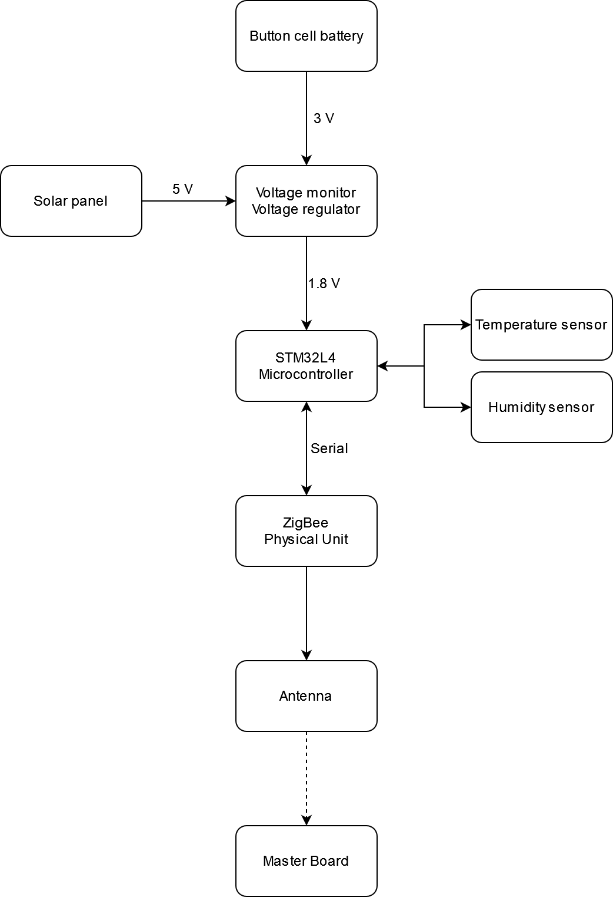
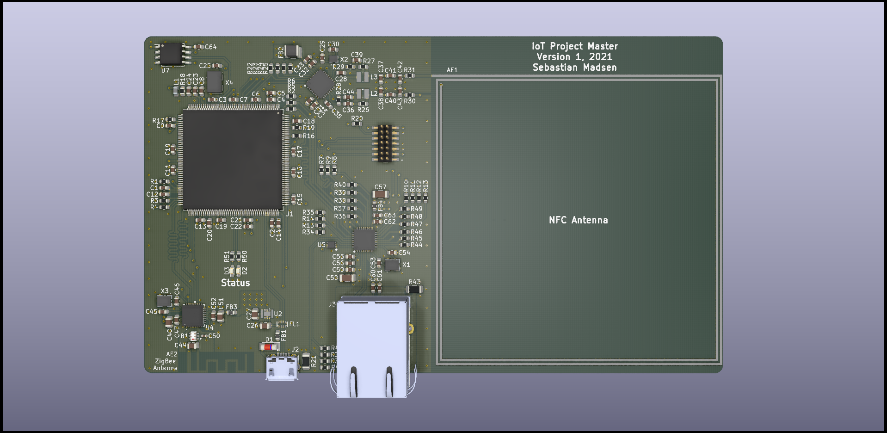
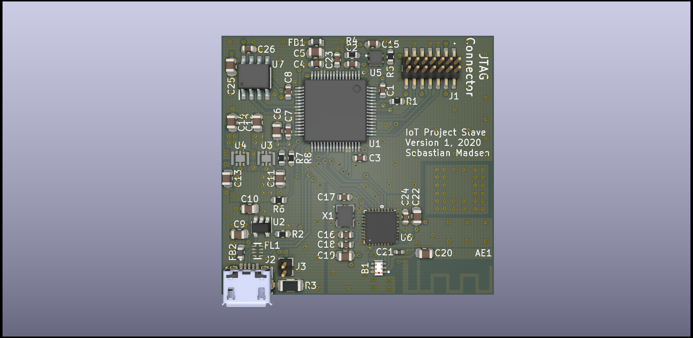

# Wireless Sensor Network
STM32-based project for testing Internet of Things, Ethernet, RFID, and similar technologies.

## Repository Structure
This repository contains a folder for documentation, which includes datasheets and reference manuals used during the design phase as well as other tools and general documents. Additionally, there are folders for the Master board and Slave board. These further includes demo programs used for testing functionality that is possible to test on either the STM32F769-DISCO, STM32L412 Nucleo, or STM32WB55 Nucleo boards. The actual program used for each board is placed in a separate, aptly named, folder. The PCBs themselves are also found as KiCad projects within either the Master or Slave folder.

## Overview
The project will contain one large Master board with many functionalities and several small Slaves only used for measuring sensor values. The slaves are powered by a coin-cell battery, and will thus be in sleep mode most of the time. Occasionally, they will wake and retrieve sensor measurements, which are transmitted over 2.4 GHz ZigBee to the Master. The Master is supplied through USB and will, aside from receiving data from the Slaves, contain an RFID antenna used for detecting valid cards/keys, which allow the user to initiate a data transfer. This data transfer may be through USB or Ethernet, as the Master will host a small webpage containing the data from each Slave.

A full block diagram of the project can be found as draw.io files in the Documentation folder, but is also shown below. In the documentation folder, a LaTeX report can also be found.

## Hardware
The designed PCBs are shown below.

## Software
By using ST development kits and the STM32Cube ecosystem, preliminary software has been created for both the master and slave.